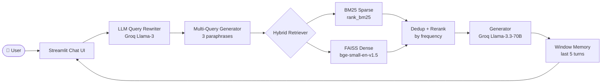

# 📋 Policy RAG Assistant

[](https://streamlit.io)
[](https://groq.com)
[](https://python.org)
[](LICENSE)

> **Ask questions about policy documents in natural language.** Multi-turn chat with hybrid retrieval, LLM query rewriting, and window memory — all running free on Groq's inference API.

---

## 🚀 Live Demo

**[➡️ Live demo on Hugging Face Spaces](https://huggingface.co/spaces/Ananya95/rag-policy-assistant)** · **[App URL](https://ananya95-rag-policy-assistant.hf.space)**

---

## 🏗️ Architecture



---

## 🛠️ Tech Stack

| Component | Technology |
|---|---|
| **LLM** | Groq Llama-3.3-70B-Versatile (free API) |
| **Embeddings** | `BAAI/bge-small-en-v1.5` (sentence-transformers) |
| **Vector store** | FAISS CPU |
| **Sparse retrieval** | BM25 (rank_bm25) |
| **PDF parsing** | pypdf |
| **Memory** | `ConversationBufferWindowMemory` (k=5, custom) |
| **Query rewriting** | LLM-based standalone question rewriter |
| **Multi-query** | 3 LLM paraphrases → retrieve → dedup → rerank |
| **Framework** | LangChain 1.2 |
| **UI** | Streamlit 1.56 |
| **Deployment** | Hugging Face Spaces |

---

## ✨ Features

- **Hybrid Retrieval** — BM25 (keyword) + FAISS (semantic) fusion
- **LLM Query Rewriter** — rewrites follow-up questions into standalone queries using chat history
- **Multi-Query Retrieval** — generates 3 paraphrases, retrieves for each, deduplicates, reranks by retrieval frequency
- **ConversationBufferWindowMemory** — keeps the last 5 turns (10 messages) in a sliding window deque
- **Multi-turn Chat UI** — full chat history display with role bubbles in Streamlit
- **Zero-cost inference** — Groq free tier, HF Spaces free tier

---

## ☁️ Deploy on Hugging Face Spaces

1. Create a Space: **Streamlit** SDK, link this repo.
2. In Space **Settings → Repository secrets**, add `GROQ_API_KEY`.
3. Optional: `COHERE_API_KEY` for reranking.
4. Ensure Git LFS files (`data/Faiss_Index/*`) are pulled on build.
5. App URL: https://ananya95-rag-policy-assistant.hf.space

If the build fails, check logs for missing deps — `requirements.txt` includes `langchain-community` and `pymupdf`.

---

## 🚀 Run Locally

```bash
# 1. Clone
git clone https://github.com/Ananya-95/rag-policy-assistant.git
cd rag-policy-assistant

# 2. Install
pip install -r requirements.txt

# 3. Add your Groq API key (free at console.groq.com)
echo "GROQ_API_KEY=gsk_..." > .env

# 4. Drop PDFs into data/Docs/ and build index
python main.py index

# 5. Launch
streamlit run streamlit_app.py
```

---

## 📁 Project Structure

```
rag-policy-assistant/
├── streamlit_app.py          # Streamlit UI entry point
├── ingest.py                 # Standalone: build FAISS index from PDFs
├── main.py                   # CLI: index | ask
├── src/
│   ├── pipeline/
│   │   └── rag_pipeline.py   # RAGPipeline + ConversationBufferWindowMemory
│   ├── retrieval/
│   │   ├── hybrid.py         # HybridRetriever (BM25 + FAISS)
│   │   └── retriever.py      # Dense-only retriever
│   ├── embedding/
│   │   └── embedder.py       # bge-small-en-v1.5 wrapper
│   ├── vectorstore/
│   │   └── faiss_store.py    # FAISS index build/load/search
│   ├── ingestion/
│   │   └── ingest.py         # PDF → chunks
│   └── llm/
│       └── groq_client.py    # Groq API wrapper
├── config/
│   └── settings.py           # Pydantic settings
├── data/
│   ├── Docs/                 # Source PDFs
│   ├── Faiss_Index/          # Pre-built FAISS index
│   └── chunks.json           # Serialised chunk store
├── evals/
│   ├── golden.json           # 25 Q&A pairs for RAGAS
│   ├── manual_run.md         # 10-question manual eval log
│   ├── hybrid_vs_dense.md    # A/B retrieval notes
│   └── run_eval.py           # Automated dense vs hybrid eval
├── tests/
│   └── test_retriever.py     # Unit tests for retrieval
├── PLAN.md                   # Week 2 roadmap
└── requirements.txt
```

---

## 📊 Evaluation

```bash
# Manual smoke test (needs GROQ_API_KEY)
python main.py ask "What is RAASB?"

# A/B dense vs hybrid on golden set (first 10 questions)
python evals/run_eval.py --mode dense --limit 10 -o evals/dense_results.json
python evals/run_eval.py --mode hybrid --limit 10 -o evals/hybrid_results.json

# RAGAS metrics (optional; needs GROQ_API_KEY)
python evals/run_eval.py --mode hybrid --limit 5 --ragas
```

---

## 💡 What I Learned

Building this end-to-end RAG system taught me:

1. **Hybrid retrieval beats either alone** — BM25 catches exact keyword matches that dense embeddings miss (policy IDs, codes, names), while FAISS handles semantic paraphrases.
2. **Query rewriting is the highest-leverage improvement** — a single LLM call to rephrase "what about that?" into a standalone question dramatically improves multi-turn accuracy.
3. **Multi-query retrieval + frequency reranking** is a cheap, effective approximation to learned rerankers — documents that survive 4 different phrasings are almost always relevant.
4. **Sliding window memory** (deque) is simpler and faster than LangChain's `ConversationBufferWindowMemory` and avoids the full LangChain chain abstraction overhead.
5. **FAISS on CPU is fast enough** for sub-second retrieval on corpora up to ~100k chunks.

---

## 📝 License

MIT — see [LICENSE](LICENSE).
